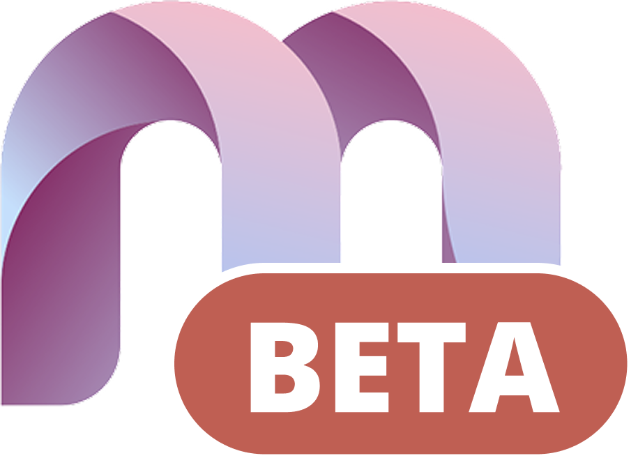

<p align="center">
  <p align="center">
   
  </p>
	<h1 align="center"><b>ExpectedEval</b></h1>
	<p align="center">
		A human-like chess engine with expected evaluation features.
    <br />
    <a href="https://github.com/raccrompton/ExpectedEval"><strong>ExpectedEval »</strong></a>
    <br />
    <br />
  </p>
</p>

This repository contains the source code for **ExpectedEval**, a modern chess analysis and training platform based on the Maia Chess Platform. This forked version enhances the original Maia chess engine capabilities with additional expected evaluation features and improvements. The platform leverages the Maia chess engine, developed by the University of Toronto's Computational Social Science Lab, to provide human-like move predictions and insights, while adding new functionality for advanced chess analysis. Built with Next.js, TypeScript, and Tailwind CSS.

## Getting Started

Follow these instructions to set up the development environment on your local machine.

### Prerequisites

- Node.js (v17+ recommended)
- npm (comes bundled with Node.js)

### Installation

1.  Clone the repository to your local machine:

    ```bash
    git clone https://github.com/raccrompton/ExpectedEval.git
    cd ExpectedEval
    ```

2.  Install the project dependencies using npm:
    ```bash
    npm install
    ```

### Running the Development Server

To start the local development server, run the following command. This will launch the application on `http://localhost:3000` with hot-reloading enabled.

```bash
npm run dev
```

### Building for Production

To create a production-ready build of the application, use the following command. This will compile and optimize the code, outputting the final assets to the `.next` directory.

```bash
npm run build
```

You can then start the production server with `npm run start`.

## Development Guide

This section provides guidelines for contributing to the platform's development.

### Branching Strategy

The repository follows a simple branching model:

- `main`: This branch is synced with the live deployment on Vercel. All code on this branch is considered production-ready.
- **Feature Branches**: All development work, including new features and bug fixes, should be done on separate feature branches. These branches are then merged into `main` via pull requests.

## ExpectedEval Features

This fork includes additional features and improvements over the original Maia Chess Platform:

- **Expected Evaluation Analysis**: Advanced position evaluation with expected value calculations
- **Enhanced Training Modes**: Improved puzzle and training systems
- **Custom Analysis Tools**: Additional analysis features for deeper chess insights
- **Performance Optimizations**: Various improvements to engine performance and UI responsiveness

### Conventional Commits

This project uses the [Conventional Commits](https://www.conventionalcommits.org/en/v1.0.0/) specification for commit messages. This standard creates a more readable and structured commit history. Each commit message should follow the format:

`{type}: {description}`

Common types include:

- `feat`: A new feature
- `fix`: A bug fix
- `chore`: Changes to the build process or auxiliary tools
- `style`: Code style changes (formatting, etc.)
- `refactor`: A code change that neither fixes a bug nor adds a feature
- `docs`: Documentation only changes

### Architectural Overview

The platform is architected around a modular and scalable structure, leveraging modern React patterns.

#### File Structure

The `src/` directory contains all the core application code, organized as follows:

```
src/
├── api/          # Backend API client functions, organized by feature
├── components/   # Reusable React components, structured by feature or domain
├── contexts/     # React Context providers for global state management
├── hooks/        # Custom React Hooks containing business logic and state
├── pages/        # Next.js pages, defining the application's routes
├── providers/    # Wrappers for context providers
├── styles/       # Global styles and Tailwind CSS configuration
├── types/        # TypeScript type definitions, organized by feature
└── lib/        # Utility functions and helpers
```

#### Core Concepts and Interactions

The application's logic is primarily driven by a combination of custom hooks, React contexts, and components, creating a clear separation of concerns.

- **Components (`src/components/`)**: These are the building blocks of the UI. They are designed to be "dumb" or presentational, receiving data and callbacks via props. Major features like `Analysis`, `Play`, `Openings`, and `Training` have their own dedicated component directories.

- **Hooks (`src/hooks/`)**: This is where the majority of the application's business logic resides. Each major feature has a corresponding "controller" hook (e.g., `usePlayController`, `useAnalysisController`). These hooks encapsulate state management, interactions with the chess engines, and API calls. They effectively act as state machines for their respective features.

- **Contexts (`src/contexts/`)**: To avoid prop drilling, we use React Context to provide the state and methods from our controller hooks to the component tree. For example, `PlayControllerContext` will expose the state and functions from the `usePlayController` hook to any child component that needs it, such as the `GameBoard` or `PlayControls`.

This architecture allows for a decoupled system where the UI (components) is a function of the state managed by the hooks, and the state is shared efficiently through contexts. For example, a page component under `src/pages` will initialize a controller hook. That hook's state is then provided to the component tree via a Context Provider. Child components can then consume that context to access state and dispatch actions without passing props down multiple levels.

#### Learning Resources

To better understand the patterns used in this codebase, we recommend reviewing the official documentation for these core React and Next.js features:

- [React Hooks](https://react.dev/reference/react/hooks)
- [React Context](https://react.dev/reference/react/createContext)
- [Next.js App Router](https://nextjs.org/docs)

### Client-Side Chess Engines

A key feature of the platform is its ability to run both Stockfish and Maia directly in the user's browser. This is accomplished using WebAssembly and ONNX Runtime Web.

- **Stockfish (`src/contexts/StockfishEngineContext/`)**: We use a WebAssembly (WASM) version of Stockfish for standard chess analysis. The Stockfish engine is managed through a React Context provider that provides a simple interface to interact with the engine, allowing for move evaluation streams. This provides the "objective" best moves in any given position.

- **Maia (`src/contexts/MaiaEngineContext/`)**: The Maia engine is a neural network provided as an ONNX (Open Neural Network Exchange) model. We use the `onnxruntime-web` library to load and run Maia models on the client-side. The Maia engine is managed through a React Context provider that handles the download, initialization, and execution of the various Maia models (e.g., `maia_kdd_1100` to `maia_kdd_1900`). This engine provides the "human-like" move predictions that are central to the platform's mission.

These context providers are consumed by higher-level controller hooks (like `useAnalysisController`) to provide the dual-engine analysis that powers many of the platform's features.

## Contributing Guidelines

Before contributing to ExpectedEval, please review these guidelines to ensure consistency and quality.

### Code Style and Formatting

The project uses automated code formatting and linting to maintain consistency:

- **ESLint**: Configured with Next.js, TypeScript, and Prettier integration
- **Prettier**: Enforces consistent formatting with the following settings:
  - No semicolons (`semi: false`)
  - Single quotes (`singleQuote: true`)
  - 2-space indentation (`tabWidth: 2`)
  - Automatic Tailwind CSS class sorting

### Development Workflow

1. **Setup**: Install recommended VS Code extensions for optimal development experience:

   - `dbaeumer.vscode-eslint`
   - `esbenp.prettier-vscode`
   - `silvenon.mdx`

2. **Code Quality**: Run linting before committing:
   ```bash
   npm run lint
   ```

### Code Conventions

- **File Naming**:

  - Components: PascalCase (e.g., `GameBoard.tsx`)
  - Hooks: camelCase with `use` prefix (e.g., `useLocalStorage.ts`)
  - Utilities: camelCase (e.g., `customAnalysis.ts`)

- **Import Patterns**:

  - Use absolute imports: `import { buildUrl } from 'src/api'`
  - Leverage barrel exports through `index.ts` files

- **Component Organization**: Components are organized by feature in `src/components/`

### Technical Clarifications

#### Stockfish Evaluation Perspective

**Important**: Stockfish evaluations are processed to be **from the perspective of whoever is playing the next move**, not from White's perspective.

- **Stockfish's raw output**: Always from White's perspective (positive = good for White, negative = good for Black)
- **Platform processing**: Converts to current player's perspective (positive = good for current player)
- **Implementation**: When it's Black's turn, the centipawn value is multiplied by -1

This ensures consistent interpretation where positive values always represent an advantage for the player whose turn it is. The conversion logic is documented in `src/hooks/useStockfishEngine/engine.ts:138-155`.

#### State Management Architecture

The platform uses a Context + Custom Hooks pattern:

1. **Controller Hooks**: Business logic encapsulated in hooks (e.g., `useAnalysisController`, `usePlayController`)
2. **Context Providers**: State distribution via React Context (e.g., `AuthContext`, `ModalContext`)
3. **Components**: Presentation layer consuming contexts

This architecture separates concerns and avoids prop drilling while maintaining clean component interfaces.

#### API Patterns

- **Base URL**: All API calls use `/api/v1/` prefix
- **Organization**: Feature-based modules in `src/api/`
- **Pattern**: Each module exports functions through barrel exports

## Deployment

ExpectedEval can be deployed on [Vercel](https://vercel.com/) or any Node.js hosting platform. The `main` branch contains the production-ready code. For deployment:

1. Build the production version: `npm run build`
2. Start the production server: `npm run start`
3. Or deploy to Vercel with automatic builds from the main branch

## Attribution

This project is based on the original [Maia Chess Platform](https://github.com/csslab/maia-platform-frontend) developed by the University of Toronto's Computational Social Science Lab. We extend our gratitude to the original developers for creating this excellent foundation for chess analysis and training.
